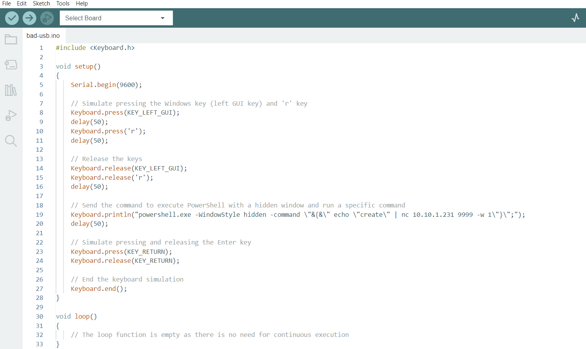

# BadUSB Attacks

The BadUSB attack leverages the ability of an Arduino board with Teensy to act as a Human Interface Device (HID) and impersonate a keyboard to exploit vulnerabilities in target systems.

## Instructions

To perform the BadUSB attack using Arduino with Teensy (version 2.0 or later) to open the vault, follow these steps:

1. Install the Arduino IDE: Download and install the latest version of the Arduino IDE from the official Arduino website (https://www.arduino.cc/en/software).

2. Install Teensyduino: Download and install the Teensyduino add-on for Arduino from the PJRC website (https://www.pjrc.com/teensy/teensyduino.html). Follow the installation instructions provided on the website.

3. Connect the Teensy board: Connect your Teensy board to your computer using a USB cable.

4. Open the Arduino IDE: Launch the Arduino IDE that you installed in Step 1.

5. Configure the Arduino IDE for Teensy:
   - In the Arduino IDE, go to `Tools > Board` and select the appropriate Teensy board model you are using.
   - Under `Tools > USB Type`, select "Keyboard" to configure Teensy as a keyboard HID.

6. Open the `bad-usb.ino` file: Go to `File > Open` and navigate to the location where you saved the `bad-usb.ino` file. Open the file in the Arduino IDE.

    

7. Verify and Upload the code: Click on the Verify (checkmark) button to compile the code. Once the compilation is successful, click on the Upload (right arrow) button to upload the code to your Teensy board.

8. Launch the BadUSB attack: After the code is successfully uploaded to the Teensy board, disconnect it from the computer. Connect the Teensy board to the target system's USB port. The code will run automatically, impersonating a keyboard and executing predefined keystrokes or commands to open the vault.