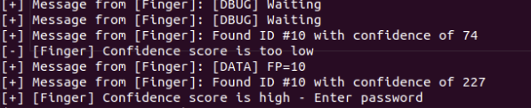
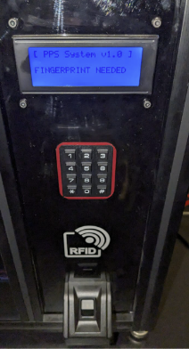

### Mitigations for Fingerprint Theft

To mitigate the risks associated with fingerprint theft, the following mitigations have been implemented:

1. **Increasing Confidence Threshold**: By increasing the threshold of confidence required for accepting a fingerprint, it becomes more challenging for an attacker to successfully use a fake fingerprint. However, one drawback of this approach is that it may increase the percentage of false negatives, where genuine fingerprints are mistakenly rejected. Care should be taken to strike the right balance between security and usability.

    

2. **Multi-Factor Authentication (MFA)**: Implementing multi-factor authentication adds an extra layer of security by requiring additional authentication factors besides the fingerprint. In the `fix-server-mfa.py` implementation, multi-factor authentication is used with a PIN and the fingerprint. This means that the user needs to provide both the correct PIN and a valid fingerprint to gain access, significantly enhancing the security of the system.

    

   > Note: The specific factors used in the MFA setup can vary but typically involve a combination of something the user knows (such as a password or PIN), something the user has (such as a smart card or token), or something the user is (biometric attributes other than fingerprints).

   **Important:** Please note that the `fix-server-mfa.py` implementation is designed for Python 2.7. If you are using a different version of Python, ensure compatibility or consider adapting the code accordingly.

For more details and implementation specifics, refer to the `fix-server-mfa.py` file.

