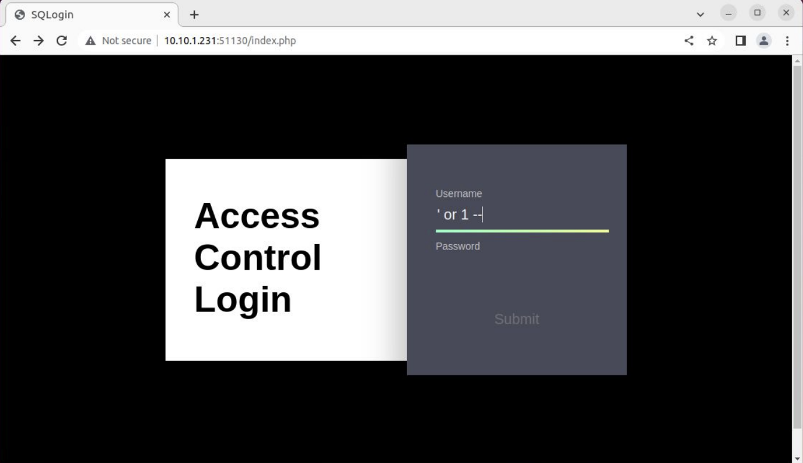
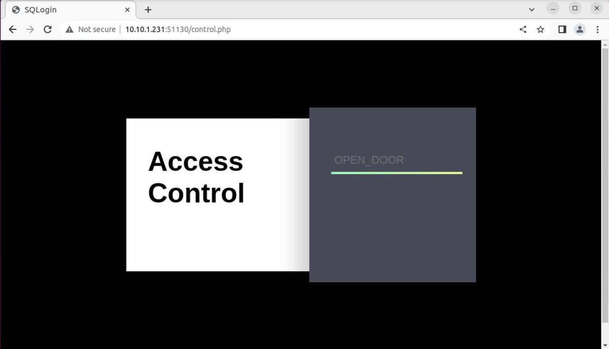

# Vulnerable Website: SQL Injection

To perform the SQL Injection attack on the vulnerable website, follow these steps:

1. Connect to the IP address of the Raspberry Pi (in our case, 10.10.1.231) on port 51130.

2. On the login page, follow these instructions:

   - In the "Username" field, enter the following string:
     ```
     ' or 1 --
     ```
   - Leave the "Password" field empty or enter any value.

   

3. Submit the login form. The SQL Injection payload `' or 1 --` manipulates the underlying SQL query, bypassing the authentication mechanism and tricks the system into authenticating the user successfully.

4. Behind the scenes, the vulnerable code snippet executes the following query:

   ```php
   $id = $_POST['id'];
   $pw = $_POST['pw'];
   $query = "SELECT id FROM user WHERE id = '{$id}' AND pw = '{$pw}'";
   $result = $db->query($query);
   if ($result == false) {
       $txt = "Login Error";
   } else {
       print("Login Successful");
   }
    ```

    The vulnerability lies in the way the code constructs the SQL query. By injecting the payload `' or 1 --`, the SQL statement becomes:

   ```php
    $query = "SELECT id FROM user WHERE id = '' or 1 -- AND pw = '{$pw}'";
    ```

    The modified query includes the injected condition `or 1`, which always evaluates to true. As a result, the authentication check is bypassed, and the system considers the login successful. Upon successful login, the vulnerable website redirects the attacker to the `control.php` page, granting them access to open the vault door.

    
